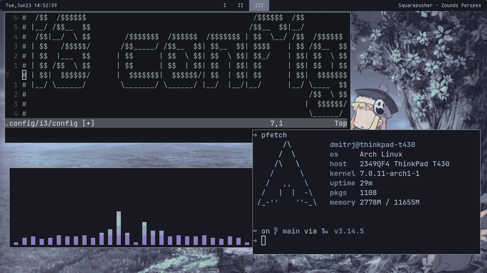
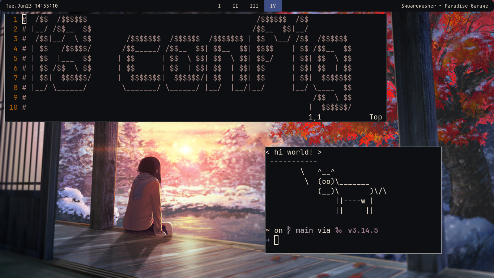

# i3wm_simplydots
Sometimes in the life of any person there is a need to use a simple graphic environment, dwn in this regard, of course, is king, but what if you need something fast, convenient? Like I put it and forget it. Just install the i3WM.

these could be dots for DWM, but so far I have a little difficulty with it, so I will have to read the documentation a little. And maybe later upload them and that's it. For now, you can enjoy definitely not a crutch i3WM))))))

What it will look like:

Or so:

Or so:

