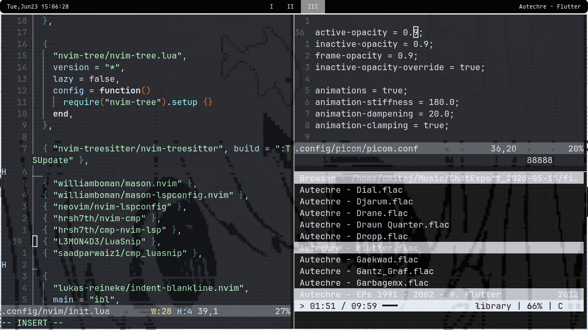

# i3wm_simplydots
Sometimes in the life of any person there is a need to use a simple graphic environment, dwn in this regard, of course, is king, but what if you need something fast, convenient? Like I put it and forget it. Just install the i3WM.


these could be dots for DWM, but so far I have a little difficulty with it, so I will have to read the documentation a little. And maybe later upload them and that's it. For now, you can enjoy definitely not a crutch i3WM))))))

What it will look like:


Or so:


Or so:



## Installation

To install these dotfiles, follow these steps:

1. **Clone the repository:**
```bash
    git clone https://github.com/Dymon1403/i3wm_simplydots.git
    cd i3wm_simplydots
    chmod +x install.sh

```

 2. **Run the script:**
```bash

   ./install.sh

```

2.1 **What are i wont??:**
```bash
Make sure you have the following packages installed on your Arch Linux system:

    polybar

    picom

    alacritty

    neovim

```

3. **You can install them using:**
```bash

sudo pacman -S polybar picom alacritty neovim

```
